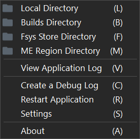
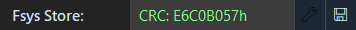
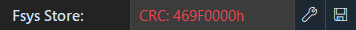
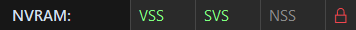
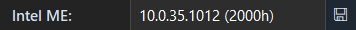

## Main Window

This section explains the main window and its functionality.

<kbd>
  
</kbd>

#### Title Area:

<kbd>
  
</kbd>
 

The current version of the application is displayed in this section. If a new version is available, the label will appear in orange. Clicking on the version number will navigate to the latest release. The menu button opens the main menu. The minimize and close buttons function as expected, allowing you to minimize or quit the application.

---

#### Main Menu:

<kbd>
  
</kbd>

**'Local Directory':**\
Navigates to the working directory where the executable is located.

**'Builds Directory':**\
Navigates to the Builds directory within the working directory, this is where edited binaries are automatically saved to.

**'Fsys Store Directory':**\
Navigates to the Fsys Store directory within the working directory. This is the default path where Fsys Stores are exported to.

**'ME Region Directory':**\
Navigates to the ME Region directory within the working directory. This is the default path where ME Regions are exported to.

**'View Application Log':**\
Opens the application log (if present), which contains details of any handled errors, or other relevant issues captured during runtime.

**'Create a Debug Log':**\
Writes a debug text log (debug.log) to the working directory, which contains information which can be used during troubleshooting.

**'Restart Application':**\
Shuts down the application and starts a new instance.

**'Settings':**\
Opens the settings window.

**'About':**\
Opens the about window.

----

#### Main Buttons:

<kbd>
  
</kbd>

**'Open':**\
By clicking the 'Open' button, you can choose and load a UEFI/BIOS file into the application.

**'Reset':**\
The 'Reset' button unloads the currently loaded file and clears any buffers and data associated with it.

**'Edit':**\
Clicking 'Edit' will open the editor window. Alternatively, it can open the terms window, which must be accepted before access to the editor is granted.

**'Copy':**\
Clicking 'Copy' opens the copy menu, which enables quick copying of text fields to the clipboard.

---

#### File:

<kbd>
  
</kbd>

This section displays the name of the loaded file and includes two buttons. Clicking the 'Folder' button will open the file explorer and highlight the location of the loaded file. The 'Reload' button can be used to refresh the loaded file from disk in case any external changes have been made.

---

#### Size (Bytes):

<kbd>
  
</kbd>
<kbd>
  
</kbd>

The file size of the loaded file is measured in bytes. If the file size is valid, the label will appear green. However, if the file size is invalid, the label will appear red, and any discrepancy in bytes will be calculated and displayed.

---

#### CRC32:

<kbd>
  
</kbd>

The CRC32 value calculated for the loaded file.

---

#### Created:

<kbd>
  
</kbd>

The creation date of the loaded file.

---

#### Modified:

<kbd>
  
</kbd>

The last write time of the loaded file.

---

#### Model:

<kbd>
  
</kbd>

First, the application retrieves the model identifier (e.g., IM161) from the UEFI/BIOS and then converts it into a readable format (e.g., iMac16,1). If the hardware configuration (HWC) is available in the Fsys store, the application appends the corresponding configuration code obtained  from the internal database or Apple's server, resulting in a complete model name (e.g., "iMac (21.5-inch, Late 2015)").

---

#### Serial:

<kbd>
  
</kbd>

This section consists of the system's serial number stored in the Fsys store within the NVRAM, and one button. Clicking the 'Globe' button will open a browser window to EveryMac and automatically load in the serial number. A valid serial number will consist of either 11 or 12 characters.

---

#### HWC:

<kbd>
  
</kbd>

The hardware configuration code is stored in the Fsys store within the NVRAM. The HWC is derived from the system serial number. If the serial number is 11 characters long, the HWC will be 3 characters. If the serial number is 12 characters long, the HWC will be 4 characters.

---

#### Fsys Store:

<kbd>
  
</kbd>
<kbd>
  
</kbd>

This section includes the checksum of the Fsys Store and two buttons. If the CRC32 checksum of the Fsys store is valid, the label will appear green and display the valid checksum. If the CRC32 is invalid, the label will appear red and display the invalid checksum. Clicking the "Wrench" button, which is enabled when the Fsys Store checksum is invalid, will prompt a "Save As" dialog to export the binary file with a repaired Fsys CRC32 checksum. The "Save" button allows exporting of the 2048-byte (0x800h) Fsys Store.

---

#### APFS Capable:

<kbd>
  
</kbd>
<kbd>
  
</kbd>

Indicates whether the UEFI is capable of supporting APFS and provides information about the detected DXE type, such as LZMA DXE. The presence of LZMA DXE suggests the presence of a compressed DXE file system containing the APFSJumpStart boot time driver.

---

#### EFI Version:

<kbd>
  
</kbd>

This section provides information about the EFI version, if available, and includes one button. Clicking the 'Arrow' button will open the ROM Information window, which displays ROM information retrieved from the `AppleRomInformationSection` GUID found in Apple UEFI only, it was not available in Apple BIOS without a flash descriptor.

---

#### NVRAM:

<kbd>
  
</kbd>
<kbd>
  
</kbd>

This section is divided into four sections. The first three labels represent different NVRAM store types. Each store type will appear green when empty, orange when data is present, and grey when the store is not found. The last item indicates the EFI Lock status. If the lock is green, the EFI does not have a Message Authentication Code (MAC) and is likely not locked. If the lock is red, a Message Authentication Code (MAC) was found, indicating that the EFI is likely password locked.

---

#### FIT Version:

<kbd>
  
</kbd>

Displays the Flash Image Tool version found in the Intel Management Engine firmware FPT header.

---

#### Intel ME:

<kbd>
  
</kbd>

This section provides information about the Intel Management Engine (ME). It displays the ME version obtained from the MN2 manifest and indicates the base position of the ME in the UEFI. Additionally, it includes one button. Clicking the 'Save' button allows exporting the entire Management Engine firmware by extracting the portion between the 'MEBase' and 'MELimit' values defined in the Intel Flash Descriptor.

---

#### Mac Board ID:

<kbd>
  
</kbd>

This section displays the 8-byte hexadecimal board-id obtained from the UEFI Platform Data Region. The Mac board-id is valuable for matching an SMC firmware or identifying a platform's logic board.

---

#### Order No:

<kbd>
  
</kbd>

The system order number (SON) is displayed in this section, retrieved from the Fsys Store within the NVRAM. The order number can be a standard order number such as MNE92LL/A or a custom Built to Order (BTO) / Configure to Order (CTO) number.

---

#### Status Bar:

<kbd>
  
</kbd>

Located at the bottom of the main window, the status bar serves multiple purposes. It displays helpful tips when hovering over specific items (this feature can be disabled in the settings). It also shows a loading animation to indicate ongoing processes or operations. Additionally, the status bar provides information about the private memory usage for the application.