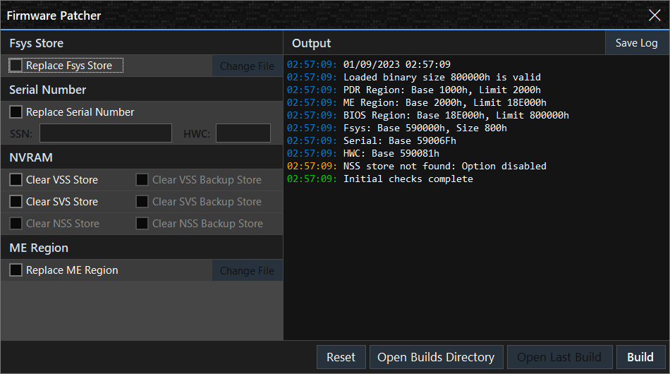
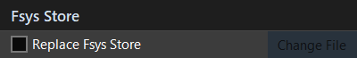
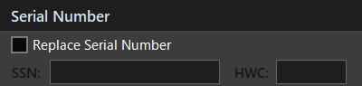
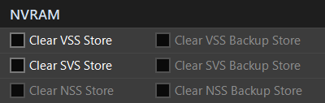
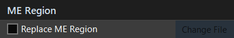
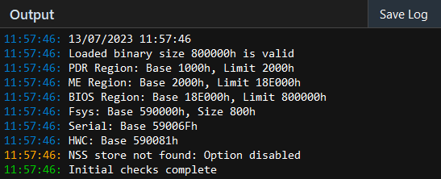

<h4 align="center">Mac EFI Toolkit Manual</h4>

  <a href="#main-window">Main Window</a> •
  <a href="#firmware-editor-window">Firmware Editor Window</a>

## Main Window

This section explains the main window and its functionality.

<kbd>
  
</kbd>

The executable and main window of the application support drag and drop functionality for files. You can easily drag and drop files from explorer directly onto the application. However, it's important to note that this functionality will not work if the application is run as an administrator, this limitation is due to the way Windows processes drag and drop operations in elevated privileges.

---

#### Title Area:

<kbd>
  
</kbd>

The current version of the application is displayed in this section. If there is a newer version available, the label will appear in orange. By clicking on the version number, you will be directed to the latest release in Github. The menu button opens the main menu, providing access to various options.

---

#### Main Menu:

<kbd>
  
</kbd>

**'Local Directory':**\
Opens the working directory where the executable is located.

**'Builds Directory':**\
Navigates to the Builds directory within the working directory, this is where edited binaries are automatically saved.

**'Fsys Store Directory':**\
Navigates to the Fsys Store directory within the working directory. This is the default location where Fsys Stores are exported.

**'ME Region Directory':**\
Navigates to the ME Region directory within the working directory. This is the default path where ME regions are exported.

**'View Application Log':**\
Opens the application log, if available, which contains details of any handled errors or relevant issues encountered during runtime.

**'Create a Debug Log':**\
Generates a debug text log (debug.log) in the working directory, which contains information useful for troubleshooting purposes.

**'Restart Application':**\
Closes the current instance of the application and launches a new one.

**'Settings':**\
Opens the settings window where you can modify various application settings.

**'About':**\
Opens the about window, providing information about the application and its version.

**'Changelog':**\
Opens a browser window directly to the application's changelog.

**'Homepage':**\
Opens a browser window to the application landing page.

**'Usage Manual':**\
Opens a browser window here, to the application manual.

----

#### Main Buttons:

<kbd>
  
</kbd>

**'OPEN':**\
By clicking the 'OPEN' button, you can choose and load a UEFI/BIOS file into the application.

**'RESET':**\
Clicking the 'RESET' button unloads the currently loaded file and clears any buffers and data associated with it.

**'COPY':**\
Clicking the 'COPY' button opens the copy menu, which enables quick copying of text fields to the clipboard.

**'EDITOR':**\
Clicking the 'EDITOR' button will open the firmware editor window. Alternatively, it can open the terms window, which must be accepted before access to the editor is granted.

---

#### File:

<kbd>
  
</kbd>

This section displays the name of the loaded file and includes two buttons. Clicking the 'Folder' button will open the file explorer and highlight the location of the loaded file. The 'Reload' button can be used to refresh the loaded file from disk in case any external changes have been made.

---

#### Size (Bytes):

<kbd>
  
</kbd>
<kbd>
  
</kbd>

The file size of the loaded file is measured in bytes. If the file size is invalid, the label will appear red, and any discrepancy in bytes will be calculated and displayed.

> 🛈 8,388,615 (>7) would indicate the given file is 7 bytes too large.

---

#### CRC32:

<kbd>
  
</kbd>

The CRC32 value calculated for the loaded file.

---

#### Created:

<kbd>
  
</kbd>

The creation date of the loaded file.

---

#### Modified:

<kbd>
  
</kbd>

The last write time of the loaded file.

---

#### Model:

<kbd>
  
</kbd>

First, the application retrieves the model identifier (e.g., IM161) from the UEFI/BIOS and then converts it into a readable format (e.g., iMac16,1). If the Hardware Configuration (HWC) is available in the Fsys store, the application appends the corresponding Configuration Code obtained from the internal database or Apple's server, resulting in a complete model name (e.g., "iMac (21.5-inch, Late 2015)").

---

#### Serial:

<kbd>
  
</kbd>

This section consists of the System Serial Number (SSN) located in the Fsys store, and one button. Clicking the 'Globe' button will open a browser window to EveryMac and automatically load in the serial number. A valid serial number will consist of either 11 or 12 characters.

---

#### HWC:

<kbd>
  
</kbd>

The Hardware Configuration Code (HWC) is located in the Fsys store and is derived from the System Serial Number (SSN). If the Serial Number is 11 characters long, the HWC will be 3 characters. If the Serial Number is 12 characters long, the HWC will be 4 characters.

---

#### Fsys Store:

<kbd>
  
</kbd>
<kbd>
  
</kbd>

This section includes the checksum of the Fsys store and two buttons. If the CRC32 of the Fsys store is valid, the label will appear green and display the valid checksum. If the CRC32 is invalid, the label will appear red and display the invalid checksum. Clicking the "Wrench" button, which is enabled when the Fsys store checksum is invalid, will prompt a "Save As" dialog to export the binary file with a repaired Fsys CRC32 checksum. The "Save" button allows exporting of the 2048-byte (0x800h) Fsys store.

---

#### Order No:

<kbd>
  
</kbd>

The System Order Number (SON) is displayed in this section, retrieved from the Fsys store. The order number can be a standard order number such as `MNE92LL/A` or a custom Built to Order (BTO) / Configure to Order (CTO) number.

---

#### EFI Version:

<kbd>
  
</kbd>

<kbd>
  
</kbd>

This section provides information about the firmware version, and includes one button. Clicking the 'Arrow' button will open the ROM Information window, which displays ROM information retrieved from the `AppleRomInformationSection` GUID found in Apple UEFI only, it was not available in Apple BIOS without a flash descriptor.

---

#### NVRAM:

<kbd>
  
</kbd>
<kbd>
  
</kbd>

This section is divided into four items. The first three items represent different NVRAM store types, indicating their status. Each store type will appear white when empty, green when data is present, and grey when the store is not found.

The padlock item represents EFI Lock status. If the padlock icon is green and unlocked, it signifies that a Message Authentication Code (MAC) was not found, indicating that the EFI is likely not locked. Conversely, if the padlock icon is red and locked, it suggests that a Message Authentication Code (MAC) was found, indicating that the EFI is likely password locked.

---

#### Mac Board ID:

<kbd>
  
</kbd>

This section displays the 8-byte hexadecimal board-id obtained from the UEFI Platform Data Region. The Mac board-id is valuable for matching an SMC firmware or identifying a platform's logic board.

---

#### APFS Capable:

<kbd>
  
</kbd>
<kbd>
  
</kbd>
<kbd>
  
</kbd>

The application provides information regarding the presence of the UEFI APFS DXE driver and the firmware's capability to support APFS boot. If the driver is detected, it will display `YES (DXE)` to indicate that an uncompressed driver was found. If the driver is found within an LZMA compressed volume, it will display `YES (LZMA DXE)` to indicate that the driver was located in an LZMA compressed volume.

---

#### FIT Version:

<kbd>
  
</kbd>

Displays the Flash Image Tool version found in the Intel Management Engine firmware FPT header.

---

#### Intel ME:

<kbd>
  
</kbd>

This section provides information about the Intel Management Engine (ME). It displays the ME version obtained from the MN2 manifest and indicates the base position of the ME in the UEFI. Additionally, it includes one button. Clicking the 'Save' button allows exporting the entire Management Engine firmware by extracting the portion between the 'MEBase' and 'MELimit' values defined in the Intel Flash Descriptor.

---

#### Status Bar:

<kbd>
  
</kbd>

Located at the bottom of the main window, the status bar serves multiple purposes. It displays helpful tips when hovering over specific items (this feature can be disabled in the settings). It also shows a loading animation to indicate ongoing processes or operations. Additionally, the status bar provides information about the private memory usage for the application.

---

## Firmware Editor Window

This section explains the firmware editor window and its functionality.

<kbd>
  
</kbd>

---

#### Fsys Store:

<kbd>
  
</kbd>

When the checkbox is activated, an open file dialog will be prompted, enabling the selection and opening of the new Fsys Store. If you want to choose a different file, simply click the 'Change File' button to reopen the file dialog.

The application will verify the new Fsys Store, if CRC masking is require this will be done automatically at build time.

> 🛈 The `Replace Serial Number` option is not available when `Replace Fsys Store` is selected.

---

#### Serial Number:

<kbd>
  
</kbd>

When the checkbox is activated, it will enable the 'SSN' textbox, allowing input of a new serial number. Once a valid serial number is entered, the Hardware Configuration code (HWC) will be automatically determined based on the provided serial number. It is important to note that you cannot change the HWC separately from the serial number. The HWC must match the serial number and cannot be modified independently.

The application will automatically enforce the required length of the serial number, allowing for either 11 or 12 characters. It will also provide validation to ensure that only valid characters are entered. This helps to ensure that the serial number input meets the necessary criteria and maintains the expected format.

The editor will automatically verify and mask the Fsys Store CRC32 after the serial number patching is complete.

> 🛈 The `Replace Fsys Store` option is not available when `Replace Serial Number` is selected.

---

#### NVRAM:

<kbd>
  
</kbd>

In this section, you have the option to clear specific NVRAM stores. By selecting 'Clear VSS Store', a general PRAM reset will be performed, similar to using CMD + SHIFT + P + R on the Mac keyboard. This action helps in resetting parameters stored in the VSS Store.

Alternatively, selecting 'Clear SVS Store' will remove the EFI lock in the event that a customer has forgotten their EFI password. This action effectively clears the SVS Store, which contains the Message Authentication Code (MAC) responsible for storing the EFI password.

The NSS store's specific purpose is currently unknown to me. It is included as an option for users who are knowledgeable about its functionality and potential use cases.

---

#### ME Region:

<kbd>
  
</kbd>

When the checkbox is activated, an open file dialog will be prompted, allowing selection of a donor or clean Management Engine (ME) firmware. This feature proves useful for scenarios such as migrating a ME Region from a faulty UEFI to a donor UEFI. Additionally, it can be utilized to write a configured ME Region from a matching clean Apple firmware.

A repository of clean Apple firmware can be found here on [Github](https://github.com/gdbinit/firmware_vault). This repository provides a collection of clean Apple firmware files containing clean and configured ME regions.

It is important for the user to ensure the accurate replacement of the ME Region when utilizing the application. The application allows for the transfer of a dumped or configured region but does not provide a guarantee of accuracy.

For users who require a higher level of certainty and guidance in replacing the ME region, I recommend referring to resources such as the guide available on [Win-Raid](https://winraid.level1techs.com/t/guide-clean-dumped-intel-engine-cs-me-cs-txe-regions-with-data-initialization/31277) written by platomav, or the post on [Logi.wiki](https://www.logi.wiki/index.php/Clean_EFI_ME_Region). These resources provide comprehensive instructions and information on performing a clean replacement of the ME Region while ensuring data integrity and accuracy.

---

#### Output:

<kbd>
  
</kbd>

This section includes a single button and the output log. By clicking the 'Save Log' button, a save file dialog will be prompted, allowing you to export the log text to a file of your choice.

The output log serves as a valuable source of information during the validation and build process. It provides necessary details and updates to keep the user informed about the progress and status of these processes.

---

#### Editor Buttons:

<kbd>
  
</kbd>

**Reset:**\
When you click the 'Reset' button, it initiates a process that resets the editor and unloads any loaded files, such as the Fsys store and ME region.

**Open Build Directory:**\
Navigates to the Builds directory within the working directory, this is where edited binaries are automatically saved when the 'Build' button is used.

**Open Last Build:**\
Clicking 'Open Last Build' will close the firmware editor window and load in the last successfully built binary into the main window.

**Build**\
The 'Build' button generates a new binary file based on the user specified preferences.

---