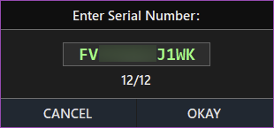
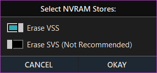

## Application Manual

1. [Useful Notes](#useful-notes)
2. [Startup Window](#startup-window)
    - [Keyboard Shortcuts](#keyboard-shortcuts)
    - [Main Menu](#main-menu)
    - [Options Menu](#options-menu)
3. [EFIROM Window](#efirom-window)
    - [Keyboard Shortcuts](#keyboard-shortcuts-1)
    - [Main Menu](#main-menu-1)
    - [Export Menu](#export-menu)
    - [Patch Menu](#patch-menu)
    - [Tools Menu](#tools-menu)
    - [Status Bar](#status-bar)
4. [SOCROM Window](#socrom-window)
    - [Keyboard Shortcuts](#keyboard-shortcuts-2)
    - [Main Menu](#main-menu-2)
    - [Export Menu](#export-menu-1)
    - [Patch Menu](#patch-menu-1)
    - [Tools Menu](#tools-menu-1)
    - [Status Bar](#status-bar-1)
5. [Serial Number Patching](#serial-number-patching)
6. [Erase NVRAM (EFI)](#erase-nvram-efi)
7. [Replace Fsys Store (EFI)](#replace-fsys-store-efi)
8. [Replace Intel ME Region (EFI)](#replace-intel-me-region-efi)
9. [Fix Fsys Checksum (EFI)](#fix-fsys-checksum-efi)
10. [Invalidate EFI Lock (EFI)](#invalidate-efi-lock-efi)
11. [Write New SCfg Store (SOC)](#write-new-scfg-store-soc)

## Useful Notes

- Mac EFI Toolkit creates its own directories within the working directory to extract and store files. The application is designed to be self-contained, ensuring that all necessary files and data are managed within the application's working environment.
- The Startup, EFIROM, and SOCROM windows all support drag-and-drop functionality. However, when running the application as an administrator, this feature will be disabled due to Windows security mechanisms and the way it handles file access. There is generally no need to run the application as an administrator.
- The EFIROM and SOCROM windows display application memory usage in the title bar, and this data will refresh every four seconds. This feature does not work under Wine, as the GetProcessMemoryInfo() API call is only implemented as a stub method in the Wine compatibility layer.
- In the event of an unhandled exception, the application will automatically capture the error and generate a log file in the working directory. This log can be uploaded to GitHub issues if needed for troubleshooting.
- In the EFIROM window, the '@' icon in the status bar becomes clickable when an email address is detected within the firmware. Clicking the icon will display the detected email address.

## Startup Window

This section explains the Startup Window and its functionality.

<kbd>
  
</kbd>

### Keyboard Shortcuts
- **Browse for a Firmware**: `CTRL + O`
- **Open Folders Menu**: `CTRL + L`
- **Open Options Menu**: `CTRL + T`
- **Open Help Menu**: `CTRL + H`
- **New EFIROM Session**: `F2`
- **New SOCROM Session**: `F3`
- **Open Settings Window**: `F4`
- **Open Manual**: `F1`
- **View Application Log**: `F12`

### Main Menu
| Button     | Description                                                                                           |
|------------|-------------------------------------------------------------------------------------------------------|
| **Folders**| Opens the folders menu for quick access to essential directories.                                     |
| **Options**  | Opens the options menu.                                                          |
| **Help**   | Opens the help menu.                                                                                 |
| **Browse** | Opens a file dialog to load a compatible firmware into the application. |

### Options Menu
- **New EFIROM Session**: Launches a new EFIROM session window.
- **New SOCROM Session**: Launches a new SOCROM session window.
- **Restart Application**: Restarts the application, closing the current session and starting fresh.

## EFIROM Window

This section explains the EFIROM Window and its functionality.

<kbd>
  
</kbd>

### Keyboard Shortcuts
- **Browse for a Firmware**: `CTRL+ O`
- **Open Folders Menu**: `CTRL + L`
- **Open Copy Menu**: `CTRL + C`
- **Open Export Menu**: `CTRL + E`
- **Open Patch Menu**: `CTRL + P`
- **Open Tools Menu**: `CTRL + T`
- **Open Help Menu**: `CTRL + H`
- **View ROM Information**: `CTRL + I`
- **Reset Window**: `CTRL + R`
- **Reload File from Disk**: `F5`
- **Open Manual**: `F1`
- **View Application Log**: `F12`
- **Open Settings Window**: `F4`
- **Open Loaded File Location**: `CTRL + SHIFT + L`
- **Toggle Serial Number View**: `CTRL + SHIFT + N`
- **Close Window**: `ESC`

### Main Menu
| Button     | Description                                                                                           |
|------------|-------------------------------------------------------------------------------------------------------|
| **Open**   | Opens a file dialog to load a compatible EFI file into the application.                               |
| **Folders**| Opens the folders menu for quick access to essential directories.                                     |
| **Copy**   | Opens the copy menu, allowing you to copy key data to the clipboard.                                   |
| **Export** | Opens the export menu with options to save specific firmware data.                                     |
| **Patch**  | Opens the patching menu, offering options to modify firmware data.                                    |
| **Tools**  | Opens a menu with additional firmware tools.                                                          |
| **Help**   | Opens the help menu.                                                                                 |

### Export Menu
- **Export Fsys Store**: Exports the Fsys Store located within NVRAM.
- **Export Intel ME Region**: Exports the Intel Management Engine region.
- **Export NVRAM VSS Stores**: Exports the VSS (Variable Storage Subsystem) stores within NVRAM.
- **Export NVRAM SVS Stores**: Exports the SVS (Secure Variable Store) within NVRAM.
- **Export LZMA DXE Archive**: Allows exporting of the decompressed LZMA DXE archive, which can be opened with 7-zip.
- **Backup Firmware (ZIP)**: Compresses and saves the loaded firmware as a ZIP archive.
- **Export Firmware Information (Text)**: Saves firmware information to a text file.
- **Export Find My Mac Email (Text)**: Saves the email found in the NVRAM `FindMyMac` token to a text file, if available.

### Patch Menu
> Access to the patching menu requires accepting the editing terms.
- **Change Serial Number**: Opens a window to enter a new System Serial Number.
- **Erase NVRAM**: Opens a window to select and erase the VSS and/or SVS NVRAM stores.
- **Replace Fsys Store**: Allows selection and replacement of the Fsys store within NVRAM.
- **Fix Fsys Checksum**: Automatically corrects an invalid checksum in the Fsys store.
- **Invalidate EFI Lock**: Invalidates the Message Authentication Code in the SVS NVRAM, safely disabling the EFI password.

### Tools Menu
- **Generate Filename**: Generates a structured filename for the firmware and copies it to the clipboard.
- **Lookup Serial Number**: Opens EveryMac in a browser and auto-inserts the System Serial Number for quick lookup (internet connection required).
- **View ROM Information**: Displays details from the firmware’s AppleRomInformation section.
- **Reset Window**: Unloads the firmware data, and resets the window to default.
- **Reload File from Disk**: Reloads the firmware file to reflect any changes made on disk.

### Status Bar
- **Firmware Parse Time**: The leftmost label displays the time taken by the application to process the firmware.
- **File Glyph**: Indicates whether an LZMA DXE archive was found within the firmware.
- **Email Glyph**: Indicates whether a Find My Mac email was detected in the NVRAM.
- **Tooltips**: The status bar shows important messages and keyboard shortcuts.

## SOCROM Window

This section explains the SOCROM Window and its functionality.

<kbd>
  
</kbd>

### Keyboard Shortcuts
- **Browse for a Firmware**: `CTRL+ O`
- **Open Folders Menu**: `CTRL + L`
- **Open Copy Menu**: `CTRL + C`
- **Open Export Menu**: `CTRL + E`
- **Open Patch Menu**: `CTRL + P`
- **Open Tools Menu**: `CTRL + T`
- **Open Help Menu**: `CTRL + H`
- **Reset Window**: `CTRL + R`
- **Reload File from Disk**: `F5`
- **Open Manual**: `F1`
- **View Application Log**: `F12`
- **Open Settings Window**: `F4`
- **Open Loaded File Location**: `CTRL + SHIFT + L`
- **Toggle Serial Number View**: `CTRL + SHIFT + N`
- **Close Window**: `ESC`

### Main Menu
| Button     | Description                                                                                           |
|------------|-------------------------------------------------------------------------------------------------------|
| **Open**   | Opens a file dialog to load a compatible T2 SOCROM file into the application.                               |
| **Folders**| Opens the folders menu for quick access to essential directories.                                     |
| **Copy**   | Opens the copy menu, allowing you to copy key data to the clipboard.                                   |
| **Export** | Opens the export menu with options to save specific firmware data.                                     |
| **Patch**  | Opens the patching menu, offering options to modify firmware data.                                    |
| **Tools**  | Opens a menu with additional firmware tools.                                                          |
| **Help**   | Opens the help menu.                                                                                 |

### Export Menu
- **Export SCfg Store**: Exports the SCfg store located in the firmware.
- **Backup Firmware (ZIP)**: Compresses and saves the loaded firmware as a ZIP archive.
- **Export Firmware Information (Text)**: Saves firmware information to a text file.

### Patch Menu
> Access to the patching menu requires accepting the editing terms.
- **Change Serial Number**: Opens a window to enter a new System Serial Number.
- **Write New SCfg Store**: Allows selection and replacement of the SCfg store within firmware.

### Tools Menu
- **Lookup Serial Number**: Opens EveryMac in a browser and auto-inserts the System Serial Number for quick lookup (internet connection required).
- **Reset Window**: Unloads the firmware data, and resets the window to default.
- **Reload File from Disk**: Reloads the firmware file to reflect any changes made on disk.

### Status Bar
- **Firmware Parse Time**: The leftmost label displays the time taken by the application to process the firmware.
- **Tooltips**: The status bar shows important messages and keyboard shortcuts.

## Serial Number Patching

Both the EFIROM and SOCROM windows follow the same procedure for serial number patching.

1. From the main menu, select `Patch > Change Serial Number`. A prompt will appear, asking for the new system serial number. Enter the new serial number and click `OKAY` to proceed.

<kbd>
  
</kbd>

2. After confirming the new serial number, the prompt will close. The application will update the Fsys region with the new serial data and automatically correct the CRC32 checksum. Once the process is complete, a save dialog will appear, allowing you to export the modified firmware binary.

## Erase NVRAM (EFI)

1. From the main menu, select `Patch > Erase NVRAM`. A prompt will appear, allowing you to choose the desired NVRAM regions (VSS, SVS). Select the regions to be erased and click `OKAY` to proceed.

<kbd>
  
</kbd>

2. Once the selected regions are confirmed, the prompt will close. The application will initialize the NVRAM store headers, clear the data (set to 0xFF), and confirm the stores were erased successfully. After completion, a save dialog will appear, allowing you to export the modified firmware binary.

## Replace Fsys Store (EFI)

**Note:** The application can extract the Fsys Store region from any EFI firmware (when available). To do this, open the desired firmware and, from the main menu, select `Export > Export Fsys Store`. A save dialog will appear, allowing you to export the 800h Fsys Block.

1. From the main menu, select `Patch > Replace Fsys Store`. An open file dialog will appear, allowing you to select the new Fsys Store region.

2. After selecting the new Fsys Store, the application will validate the file, automatically mask the checksum if needed, and write the new region into the firmware. Once the process is complete, a save dialog will appear, allowing you to export the modified firmware binary.

## Replace Intel ME Region (EFI)

**Note:** It is important for the user to ensure accurate replacement of the ME Region when utilizing the application. The application allows for the transfer of a dumped or configured region but does not provide a guarantee of accuracy. A repository of clean Apple firmware can be found here on [Github](https://github.com/gdbinit/firmware_vault). This repository provides a collection of clean Apple firmware files containing clean and configured ME regions that can be extracted using Mac EFI Toolkit. To do so, open the desired firmware and, from the main menu, select `Export > Export Intel ME Region`. A save dialog will appear, allowing you to export the Intel ME region.

For users who require a higher level of certainty and guidance in replacing the ME region, I recommend referring to resources such as the guide available on [Win-Raid](https://winraid.level1techs.com/t/guide-clean-dumped-intel-engine-cs-me-cs-txe-regions-with-data-initialization/31277) written by platomav, or this post on [Logi.wiki](https://logi.wiki/index.php/Clean_EFI_ME_Region). These resources provide comprehensive instructions and information on performing a clean replacement of the ME Region while ensuring accuracy.

1. From the main menu, select `Patch > Replace Intel ME Region`. An open file dialog will appear, allowing you to select the new ME region.

2. After selecting the new ME region, the application will validate the file, and write the new region into the firmware. Once the process is complete, a save dialog will appear, allowing you to export the modified firmware binary.

## Fix Fsys Checksum (EFI)

**Note:** This option is only available when an invalid Fsys CRC32 checksum is detected.

To fix the checksum, go to the main menu and select `Patch > Fix Fsys Checksum`. The application will automatically repair the Fsys checksum and verify that it has been written successfully. Once the process is complete, a save dialog will appear, allowing you to export the modified firmware binary.

## Invalidate EFI Lock (EFI)

**Note:** This option is only available when a Message Authentication Code (MAC) is detected in the SVS NVRAM.

To safely disable the EFI lock while retaining the Secure Variable Store (SVS), go to the main menu and select `Patch > Invalidate EFI Lock`. The application will invalidate the Message Authentication Code in each applicable store, write the updated data back to the firmware, and verify the changes were applied successfully. Once the process is complete, a save dialog will appear, allowing you to export the modified firmware binary.

## Write New SCfg Store (SOC)

**Note:** If no SCfg store is detected in the target firmware, the application will automatically assign a base address of `0x28A000h` for the new store. Before proceeding, the application will verify that this region in the target firmware is clear of data (0xFF). If the region is not empty, the write operation will be refused.

The application can extract the SCfg Store region from any SOC firmware (when available). To do this, open the desired firmware and, from the main menu, select `Export > Export SCfg Store`. A save dialog will appear, allowing you to export the store.

1. From the main menu, select `Patch > Write new SCfg Store`. An open file dialog will appear, allowing you to select the new store.

2. After selecting the new SCfg store, the application will validate the file, and write the new region into the firmware. Once the process is complete, a save dialog will appear, allowing you to export the modified firmware binary.