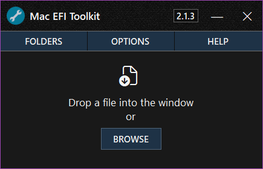

## Startup Window

This section explains the Startup Window and its functionality.

<kbd>
  
</kbd>

### Keyboard Shortcuts
- **Browse for a Firmware**: `CTRL + O`
- **Open Folders Menu**: `CTRL + L`
- **Open Tools Menu**: `CTRL + T`
- **Open Help Menu**: `CTRL + H`
- **New EFIROM Session**: `F2`
- **New SOCROM Session**: `F3`
- **Open Settings Window**: `F4`
- **Open Manual**: `F1`
- **View Application Log**: `F12`

TODO

## EFIROM Window

This section explains the EFIROM Window and its functionality.

<kbd>
  
</kbd>

### Keyboard Shortcuts
- **Browse for a Firmware**: `CTRL+ O`
- **Open Folders Menu**: `CTRL + L`
- **Open Copy Menu**: `CTRL + C`
- **Open Export Menu**: `CTRL + E`
- **Open Patch Menu**: `CTRL + P`
- **Open Tools Menu**: `CTRL + T`
- **Open Help Menu**: `CTRL + H`
- **View ROM Information**: `CTRL + I`
- **Reset Window**: `CTRL + R`
- **Reload File from Disk**: `F5`
- **Open Manual**: `F1`
- **View Application Log**: `F12`
- **Open Settings Window**: `F4`
- **Open Loaded File Location**: `CTRL + SHIFT + L`
- **Toggle Serial Number View**: `CTRL + SHIFT + N`

### Main Menu

| Button     | Description                                                                                           |
|------------|-------------------------------------------------------------------------------------------------------|
| **Open**   | Opens a file dialog to load a compatible EFI file into the application.                               |
| **Reset**  | Clears all firmware data and resets the window to its default view.                                   |
| **Copy**   | Opens the copy menu, allowing you to copy key data to the clipboard.                                  |
| **Folders**| Opens the folders menu for quick access to essential directories.                                     |
| **Export** | Opens the export menu with options to save firmware data in different formats.                        |
| **Patch**  | Opens the patching menu, offering tools to modify and customize firmware data.                        |
| **Options**| Opens a menu with additional firmware tools. |

- **Export Menu:**
  - **Export Fsys Store**: Exports the Fsys Store located within NVRAM.
  - **Export Intel ME Region**: Exports the Intel Management Engine region.
  - **Export NVRAM VSS Stores**: Exports the VSS (Variable Storage Subsystem) stores within NVRAM.
  - **Export NVRAM SVS Stores**: Exports the SVS (Secure Variable Store) within NVRAM.
  - **Export LZMA DXE Archive**: Allows exporting of the decompressed LZMA DXE archive, which can be opened with 7-zip.
  - **Backup Firmware (ZIP)**: Compresses and saves the loaded firmware as a ZIP archive.
  - **Export Firmware Information (Text)**: Saves firmware information to a text file.
  - **Export Find My Mac Email (Text)**: Saves the email found in the NVRAM `FindMyMac` token to a text file, if available.

- **Patch Menu:** (Access to the patching menu requires accepting the editing terms.)
  - **Change Serial Number**: Edits the System Serial Number (SSN) within the Fsys Store.
  - **Erase NVRAM**: Opens a window to select and erase the VSS and/or SVS NVRAM stores.
  - **Replace Fsys Store**: Allows selection and replacement of the Fsys store within NVRAM.
  - **Fix Fsys Checksum (CRC32)**: Automatically corrects an invalid checksum in the Fsys store.
  - **Invalidate EFI Lock**: Invalidates the Message Authentication Code in the SVS NVRAM, safely disabling the EFI password.

- **Options Menu:**
  - **Automatic Filename Generation**: Generates a structured filename for the firmware and copies it to the clipboard.
  - **Reload File from Disk**: Reloads the firmware file to reflect any changes made on disk.
  - **View Application Log**: Opens the application log file.
  - **View ROM Information**: Displays details from the firmware’s AppleRomInformation section.
  - **Lookup Serial Number**: Opens EveryMac in a browser and auto-inserts the System Serial Number for quick lookup (internet connection required).

- **Status Bar:**
  - **Firmware Parse Time**: The leftmost label displays the time taken by the application to process the firmware.
  - **File Glyph**: Indicates whether an LZMA DXE archive was found within the firmware.
  - **Email Glyph**: Indicates whether a Find My Mac email was detected in the NVRAM.
  - **Tooltips**: The status bar shows important messages and keyboard shortcuts.

## SOCROM Window

This section explains the SOCROM Window and its functionality.

<kbd>
  
</kbd>

### Keyboard Shortcuts

- **Browse for a Firmware**: `CTRL+ O`
- **Open Folders Menu**: `CTRL + L`
- **Open Copy Menu**: `CTRL + C`
- **Open Export Menu**: `CTRL + E`
- **Open Patch Menu**: `CTRL + P`
- **Open Tools Menu**: `CTRL + T`
- **Open Help Menu**: `CTRL + H`
- **Reset Window**: `CTRL + R`
- **Reload File from Disk**: `F5`
- **Open Manual**: `F1`
- **View Application Log**: `F12`
- **Open Settings Window**: `F4`
- **Open Loaded File Location**: `CTRL + SHIFT + L`
- **Toggle Serial Number View**: `CTRL + SHIFT + N`

### Main Menu

| Button     | Description                                                                                           |
|------------|-------------------------------------------------------------------------------------------------------|
| **Open**   | Opens a file dialog to load a compatible Intel T2 SOCROM firmware into the application.                               |
| **Reset**  | Clears all firmware data and resets the window to its default view.                                   |
| **Copy**   | Opens the copy menu, allowing you to copy key data to the clipboard.                                  |
| **Folders**| Opens the folders menu for quick access to essential directories.                                     |
| **Export** | Opens the export menu with options to save firmware data in different formats.                        |
| **Patch**  | Opens the patching menu, offering tools to modify and customize firmware data.                        |
| **Options**| Opens a menu with additional firmware tools. |

- **Export Menu:**
  - **Export Scfg Store**: Exports the Scfg store located in the firmware.
  - **Backup Firmware (ZIP)**: Compresses and saves the loaded firmware as a ZIP archive.
  - **Export Firmware Information (Text)**: Saves firmware information to a text file.

- **Patch Menu:** (Access to the patching menu requires accepting the editing terms.)
  - **Change Serial Number**: Edits the System Serial Number (SSN) within the Scfg Store.
  - **Write New Scfg Store**: Allows selection and replacement of the Scfg store within firmware.
 
- **Options Menu:**
  - **Reload File from Disk**: Reloads the firmware file to reflect any changes made on disk.
  - **View Application Log**: Opens the application log file.
  - **Lookup Serial Number**: Opens EveryMac in a browser and auto-inserts the System Serial Number for quick lookup (internet connection required).

- **Status Bar:**
  - **Firmware Parse Time**: The leftmost label displays the time taken by the application to process the firmware.
  - **Tooltips**: The status bar shows important messages and keyboard shortcuts.