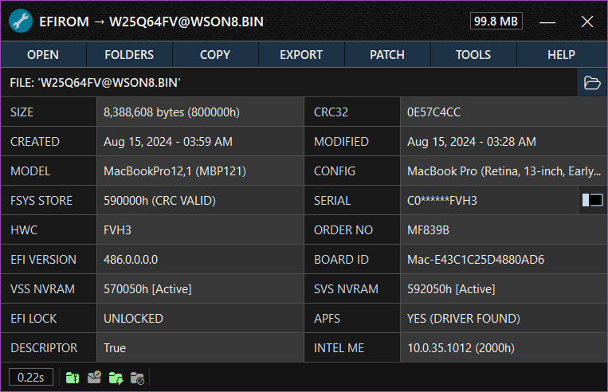

<h4 align="center">Mac EFI Toolkit Manual</h4>

  <a href="#efirom-window">EFIROM Window</a> •
  <a href="#socrom-window">SOCROM Window</a>

## EFIROM Window

This section explains the EFIROM Window and its functionality.

<kbd>
  
</kbd>

### Main Menu

| Button     | Description                                                                                           |
|------------|-------------------------------------------------------------------------------------------------------|
| **Open**   | Opens a file dialog to load a compatible EFI file into the application.                               |
| **Reset**  | Clears all firmware data and resets the window to its default view.                                   |
| **Copy**   | Opens the copy menu, allowing you to copy key data to the clipboard.                                  |
| **Folders**| Opens the folders menu for quick access to essential directories.                                     |
| **Export** | Opens the export menu with options to save firmware data in different formats.                        |
| **Patch**  | Opens the patching menu, offering tools to modify and customize firmware data.                        |
| **Options**| Opens a menu with additional firmware tools, like serial number lookup.   |

- **Export Menu:**
  - **Export Fsys Store**: Exports the Fsys Store located within NVRAM.
  - **Export Intel ME Region**: Exports the Intel Management Engine region.
  - **Export NVRAM VSS Stores**: Exports the VSS (Variable Storage Subsystem) stores within NVRAM.
  - **Export NVRAM SVS Stores**: Exports the SVS (Secure Variable Store) within NVRAM.
  - **Backup Firmware (ZIP)**: Compresses and saves the loaded firmware as a ZIP archive.
  - **Export Firmware Information (Text)**: Saves firmware information to a text file.

- **Patch Menu:**
  - **Change Serial Number**: Edits the System Serial Number (SSN) within the Fsys Store.
  - **Erase NVRAM**: Opens a window to select and erase the VSS and/or SVS NVRAM stores.
  - **Replace Fsys Store**: Allows selection and replacement of the Fsys store within NVRAM.
  - **Fix Fsys Checksum (CRC32)**: Automatically corrects an invalid checksum in the Fsys store.
  - **Invalidate EFI Lock**: Invalidates the Message Authentication Code in the SVS NVRAM, safely disabling the EFI password.

## SOCROM Window

This section explains the SOCROM Window and its functionality.

<kbd>
  
</kbd>

### Main Menu

| Button     | Description                                                                                           |
|------------|-------------------------------------------------------------------------------------------------------|
| **Open**   | Opens a file dialog to load a compatible EFI file into the application.                               |
| **Reset**  | Clears all firmware data and resets the window to its default view.                                   |
| **Copy**   | Opens the copy menu, allowing you to copy key data to the clipboard.                                  |
| **Folders**| Opens the folders menu for quick access to essential directories.                                     |
| **Export** | Opens the export menu with options to save firmware data in different formats.                        |
| **Patch**  | Opens the patching menu, offering tools to modify and customize firmware data.                        |
| **Options**| Opens a menu with additional firmware tools, like serial number lookup.   |