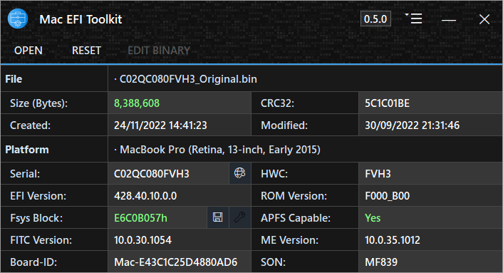

<h1 align="center">

 
Mac EFI Toolkit V1.1.5
</h1>

<h4 align="center">A tool for analysis of Mac BIOS/UEFI, with limited editing capabilities.</h4>

  <a href="#about">About</a> •
  <a href="#features">Features</a> •
  <a href="#manual">Manual</a> •
  <a href="#download">Download</a> •
  <a href="#requirements">Requirements</a> •
  <a href="#acknowledgements">Acknowledgements</a> •
  <a href="#donate">Donate</a>

## About

Mac EFI Toolkit, or 'mefit', is a valuable tool built to aid technicians in repairing Mac BIOS/UEFI. Designed to be compact, mefit provides information gathering capabilities and limited editing functionality.

Key features of the information gathering capabilities include detecting EFI lock in the NVRAM, identifying if the APFS DXE driver is present; even if located in an LZMA compressed volume, validating file sizes and calculating size discrepancy bytes, and viewing the firmware version.

In terms of editing, the application allows users to replace the System Serial Number (SSN) with automatic Hardware Configuration (HWC) matching. It also supports transplanting of exported Fsys stores, as well as the clearing firmware settings, and EFI password lock if a customer has forgotten their password. When editing, Mac EFI Toolkit will automatically check, calculate, and mask the Fsys CRC32 if the checksum is invalid.

>🛈 **Access to some features requires accepting the editing terms.**

I continue to perform extensive testing on hundreds of firmwares to ensure compatibility and functionality. As new edge cases or exceptions are discovered, the application is updated accordingly to address them. This commitment to testing and updates ensures that the application remains reliable and effective for a wide range of Mac firmware configurations.

## Features

**General:**
- Edit copies of files in memory, preserving original files.
- Backup loaded firmware to a .zip file.
- Read Intel Flash Descriptor for UEFI section positions.
- Knuth–Morris–Pratt algorithm for binary data searching.
- View the Intel Management Engine version.
- Export and transplant the Intel Management Engine region.
- View and validate the binary size.
- View the firmware CRC32, created and modified date.

**Mac Specific:**
- View if the firmware supports APFS.
- View the firmware version.
- View Apple ROM section information.
- View the configuration code, derived from the System Serial Number (ssn).

**Fsys Store:**
- View and edit the System Serial Number.
- Check the System Serial Number with EveryMac.
- View the Hardware Configuration code (hwc).
- View the System Order Number (son).
- Export and replace the Fsys store.
- Detect and repair invalid Fsys Store CRC32.

**NVRAM:**
- Clear NVRAM stores (VSS, SVS, NSS) with section header preservation.
- Identify NVRAM stores with data, empty stores, and missing stores.
- Detect and remove EFI lock.

**Platform Data Region:**
- Read the system Board-ID (UEFI version from 2013 onwards).

**Application:**
- Works with Wine (Better support coming in the future)
- Automatic handling of uncaught errors.
- Ability to create a debug log.
- No installation required.
- Support for DPI scaling.
- Drag and drop functionality.
- Notification when a newer version is available.

| SUGGESTED FEATURES                         | Status                |
|--------------------------------------------|-----------------------|
| Batch process files for information        |🟢 Addition planned    |
| Build clean firmware from FD               |🟢 Addition planned    |
| Detect email address in the NVRAM          |🟠 Researching         |
| Detect MDM status                          |🔴 Undecided           |

## Download

| Version| Release Date| Latest | Channel |
|--------|-------------|--------|---------|
|[1.1.5](https://github.com/MuertoGB/MacEfiToolkit/releases/latest)| 10th October, 2024 | Yes | Stable |
|[1.1.3](https://github.com/MuertoGB/MacEfiToolkit/releases/113)| 11th October, 2023 | No | Stable |

> 📋 View the full changelog [here](CHANGELOG.md)

## Manual

Instructions on how to use the application can be viewed in [manual](MANUAL.md).

## Requirements

**Application:**
- Microsoft [.NET Framework 4.8](https://dotnet.microsoft.com/en-us/download/dotnet-framework/net48)
- Windows 7, 8, 8.1, 10 and 11. 32, or 64-bit
- Internet connectivity required for:-
> - Version Checking (Can be disabled in settings).
> - Fetching config code from the server when not present in the database.

**Build requirements:**
- [Visual Studio 2022](https:/visualstudio.microsoft.com/vs/), targeting .NET Framework 4.8.

## Acknowledgements

**This software uses the following third party libraries, or resources:-**

LZMA [v22.01 SDK](https://www.7-zip.org/sdk.html), by Igor Pavlov.\
The [Knuth-Morris-Pratt algorithm](https://en.wikipedia.org/wiki/Knuth%E2%80%93Morris%E2%80%93Pratt_algorithm), by Donald Knuth, James H. Morris, and  Vaughan Pratt.\
[MacModelShelf](https://github.com/MagerValp/MacModelShelf) database, by MagerValp.\
Application icon by [Creatype](https://www.flaticon.com/free-icon/toolkit_6457096?term=toolkit&page=1&position=38&origin=search&related_id=6457096), menu icons by [afif-fudin](https://www.flaticon.com/authors/afif-fudin).

## Donate

All donations go back into improving my software and workspace.

