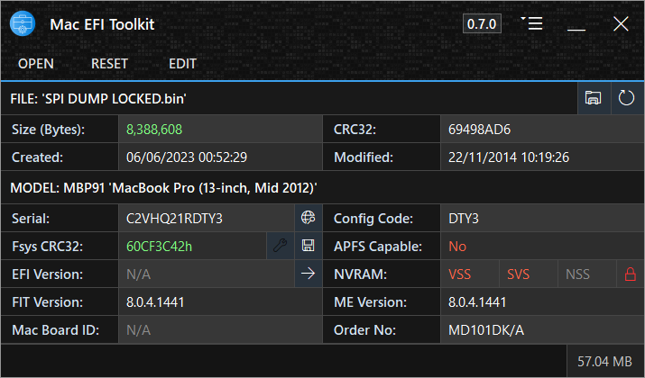

<h1 align="center">

 
Mac EFI Toolkit
</h1>

<h4 align="center">A tool for analysis of Mac BIOS firmware, with limited editing capabilities.</h4>

  <a href="#about">About</a> •
  <a href="#features">Features</a> •
  <a href="MANUAL.md">Manual</a> •
  <a href="#download">Download</a> •
  <a href="#requirements">Requirements</a> •
  <a href="#acknowledgements">Acknowledgements</a> •
  <a href="#donate">Donate</a>

## About

Mac EFI Toolkit, or 'mefit', is a valuable tool designed to aid technicians in repairing Mac BIOS/EFI files. It provides information gathering capabilities and limited editing functionality. Key features of the application include detecting EFI lock in the NVRAM, identifying the APFS DXE driver even if hidden in an LZMA compressed volume, validating file sizes and calculating size discrepancy bytes, and viewing the firmware version.

In terms of editing, mefit allows users to replace the System Serial Number (SSN) with automatic Hardware Configuration (HWC) matching and CRC32 masking. It also supports transplanting of exported Fsys stores with automatic CRC32 masking, as well as the clearing firmware settings, and EFI password lock if a customer has forgotten their password.

>🛈 **Access to some features requires accepting the editing terms.**

This application provides support for most Mac BIOS/UEFI, with the exception of the A1534 model (as of now). I continue to perform extensive testing on hundreds of firmwares to ensure compatibility and functionality. As new edge cases or exceptions are discovered, the application is updated accordingly to address them. This commitment to testing and updates ensures that the application remains reliable and effective for a wide range of Mac firmware configurations.

## Features

**Fsys Store:**
- Export and replace the Fsys store.
- View and edit the System Serial Number (ssn), and Hardware Configuration (hwc).
- View the System Order Number (son).
- Detect and repair invalid Fsys Store CRC32.
- Check Serial Number with EveryMac.

**NVRAM:**
- Clear NVRAM stores (VSS, SVS, NSS) with section header preservation.
- Identify NVRAM stores with data, empty stores, and missing stores.

**Platform Data Region:**
- Read the Board-ID (UEFI version from 2013 onwards).

**Mac Specific:**
- Detect EFI password lock.
- Check APFS capability.
- View Apple ROM section information.
- Derive Configuration Code from the Hardware Configuration (hwc).

**General:**
- Edit copies of files in memory, preserving original files.
- Read Intel Descriptor for UEFI section base and limit positions.
- Utilize Knuth–Morris–Pratt algorithm for binary data search.
- View Flash Image Tool and Management Engine versions.
- Export the Intel Management Engine region.
- Transplant the Intel Management Engine region.
- Validate binary size.

**Application:**

- Works with Wine (Better support coming in an update)
- Automatic handling of uncaught errors.
- No installation required.
- Support for DPI scaling.
- Drag and drop functionality.
- Version checking mechanism.

| SUGGESTED FEATURES                         | Status                |
|--------------------------------------------|-----------------------|
| Batch process files for information        |🟢 Coming in an update |
| Invalidate EFI lock without clearing SVS   |🟢 Coming in an update |
| Detect email address in the NVRAM          |🟠 Researching         |
| Build clean firmware from FD               |🟠 Researching         |
| Detect MDM status                          |🔴 Undecided           |

## Download

| Version| Release Date| Latest | Channel |
|--------|-------------|--------|---------|
|[1.0.1](https://github.com/MuertoGB/MacEfiToolkit/releases/latest)| Not Set | Yes | Stable |

> 📋 View the full changelog [here](CHANGELOG.md)

## Requirements

**Application:**
- Microsoft [.NET Framework 4.8](https://dotnet.microsoft.com/en-us/download/dotnet-framework/net48)
- Windows 7, 8, 8.1, 10. 32, or 64-bit
- Internet connectivity required for:-
> - Version Checking (Can be disabled in settings).
> - Fetching config code from the server when not present in the database.

**Build requirements:**
- [Visual Studio 2022](https:/visualstudio.microsoft.com/vs/), targeting .NET Framework 4.8.

## Acknowledgements

**This software uses the following third party libraries, or resources:-**

LZMA [v22.01 SDK](https://www.7-zip.org/sdk.html), by Igor Pavlov.\
The [Knuth-Morris-Pratt algorithm](https://en.wikipedia.org/wiki/Knuth%E2%80%93Morris%E2%80%93Pratt_algorithm), by Donald Knuth, James H. Morris, and  Vaughan Pratt.\
[MacModelShelf](https://github.com/MagerValp/MacModelShelf) database, by MagerValp.\
Application icon by [Creatype](https://www.flaticon.com/free-icon/toolkit_6457096?term=toolkit&page=1&position=38&origin=search&related_id=6457096) on [Flaticon](https://www.flaticon.com).

## Donate

All donations go back into improving my software and workspace.

