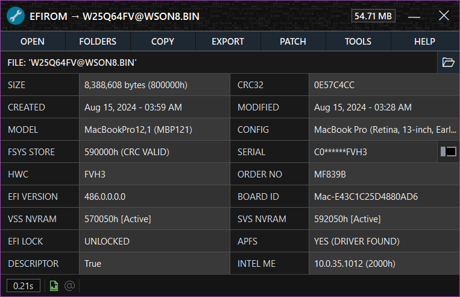
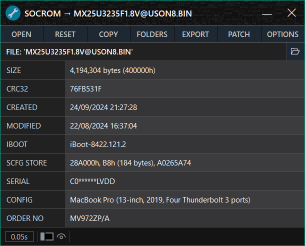

<h1 align="center">

 
Mac EFI Toolkit
</h1>

## Table of Contents
1. [Intoduction](#introduction)
2. [System Requirements](#system-requirements)
3. [Getting Started](#getting-started)
4. [EFIROM Window](#efirom-window)
5. [SOCROM Window](#socrom-window)
6. [Wine Instructions](#wine-instructions)
7. [Changelog](#changelog)
8. [Features](#features)
9. [Acknowledgements](#acknowledgements)
10. [Donate](#donate)

## Introduction

**Mac EFI Toolkit** (also known as **mefit**) is designed to aid technicians in repair and analysis of Mac EFI and Intel based Mac SOCROM firmwares. Designed to be compact, this application provides information gathering capabilities and limited patching functionality.

## System Requirements

- **Operating System:**
  - Windows 11 (64-bit)
  - Windows 10 (32/64-bit)
  - Windows 8/8.1 (32/64-bit)
  - Windows 7 (32/64-bit)
  - **mefit** is compatible with [Wine](https://www.winehq.org/)

- **Internet Connectivity** (optional, only required for specific features):
  - Receiving notifications about new versions (can be disabled in settings).
  - Fetching device configuration data from Apple’s server if not available in the internal database.
  - Checking serial numbers on EveryMac.

- **Build Requirements:**
  - [Visual Studio 2022](https://visualstudio.microsoft.com/vs/), targeting .NET Framework 4.8.

## Getting Started

1. Ensure your system has [.NET Framework 4.8](https://dotnet.microsoft.com/en-us/download/dotnet-framework/net48) installed.
2. Download the [latest version](https://github.com/MuertoGB/MacEfiToolkit/releases/latest) of **mefit**.
3. If needed, create a dump of your Mac firmware using an SPIROM programmer.
4. Launch the software (**no installation required**) and open your firmware.

## EFIROM Window

This section explains the EFIROM Window and its functionality.

<kbd>
  
</kbd>

### Main Menu

| Button     | Description                                                                                           |
|------------|-------------------------------------------------------------------------------------------------------|
| **Open**   | Opens a file dialog to load a compatible EFI file into the application.                               |
| **Reset**  | Clears all firmware data and resets the window to its default view.                                   |
| **Copy**   | Opens the copy menu, allowing you to copy key data to the clipboard.                                  |
| **Folders**| Opens the folders menu for quick access to essential directories.                                     |
| **Export** | Opens the export menu with options to save firmware data in different formats.                        |
| **Patch**  | Opens the patching menu, offering tools to modify and customize firmware data.                        |
| **Options**| Opens a menu with additional firmware tools. |

- **Export Menu:**
  - **Export Fsys Store**: Exports the Fsys Store located within NVRAM.
  - **Export Intel ME Region**: Exports the Intel Management Engine region.
  - **Export NVRAM VSS Stores**: Exports the VSS (Variable Storage Subsystem) stores within NVRAM.
  - **Export NVRAM SVS Stores**: Exports the SVS (Secure Variable Store) within NVRAM.
  - **Export LZMA DXE Archive**: Allows exporting of the decompressed LZMA DXE archive, which can be opened with 7-zip.
  - **Backup Firmware (ZIP)**: Compresses and saves the loaded firmware as a ZIP archive.
  - **Export Firmware Information (Text)**: Saves firmware information to a text file.
  - **Export Find My Mac Email (Text)**: Saves the email found in the NVRAM `FindMyMac` token to a text file, if available.

- **Patch Menu:** (Access to the patching menu requires accepting the editing terms.)
  - **Change Serial Number**: Edits the System Serial Number (SSN) within the Fsys Store.
  - **Erase NVRAM**: Opens a window to select and erase the VSS and/or SVS NVRAM stores.
  - **Replace Fsys Store**: Allows selection and replacement of the Fsys store within NVRAM.
  - **Fix Fsys Checksum (CRC32)**: Automatically corrects an invalid checksum in the Fsys store.
  - **Invalidate EFI Lock**: Invalidates the Message Authentication Code in the SVS NVRAM, safely disabling the EFI password.

- **Options Menu:**
  - **Automatic Filename Generation**: Generates a structured filename for the firmware and copies it to the clipboard.
  - **Reload File from Disk**: Reloads the firmware file to reflect any changes made on disk.
  - **View Application Log**: Opens the application log file.
  - **View ROM Information**: Displays details from the firmware’s AppleRomInformation section `{B535ABF6-967D-43F2-B494-A1EB8E21A28E}`.
  - **Lookup Serial Number**: Opens EveryMac in a browser and auto-inserts the System Serial Number for quick lookup (internet connection required).

- **Status Bar:**
  - **Firmware Parse Time**: The leftmost label displays the time taken by the application to process the firmware.
  - **Serial Toggle Switch**: Hides or displays the System Serial Number.
  - **ZIP Icon**: Indicates if an LZMA DXE archive was found within the firmware.
  - **User Icon**: Indicates if a Find My Mac email was detected in the NVRAM.
  - **Tooltips**: The status bar shows important messages and keyboard shortcuts.

## SOCROM Window

This section explains the SOCROM Window and its functionality.

<kbd>
  
</kbd>

### Main Menu

| Button     | Description                                                                                           |
|------------|-------------------------------------------------------------------------------------------------------|
| **Open**   | Opens a file dialog to load a compatible Intel T2 SOCROM firmware into the application.                               |
| **Reset**  | Clears all firmware data and resets the window to its default view.                                   |
| **Copy**   | Opens the copy menu, allowing you to copy key data to the clipboard.                                  |
| **Folders**| Opens the folders menu for quick access to essential directories.                                     |
| **Export** | Opens the export menu with options to save firmware data in different formats.                        |
| **Patch**  | Opens the patching menu, offering tools to modify and customize firmware data.                        |
| **Options**| Opens a menu with additional firmware tools. |

- **Export Menu:**
  - **Export Scfg Store**: Exports the Scfg store located in the firmware.
  - **Backup Firmware (ZIP)**: Compresses and saves the loaded firmware as a ZIP archive.
  - **Export Firmware Information (Text)**: Saves firmware information to a text file.

- **Patch Menu:** (Access to the patching menu requires accepting the editing terms.)
  - **Change Serial Number**: Edits the System Serial Number (SSN) within the Scfg Store.
  - **Write New Scfg Store**: Allows selection and replacement of the Scfg store within firmware.
 
- **Options Menu:**
  - **Reload File from Disk**: Reloads the firmware file to reflect any changes made on disk.
  - **View Application Log**: Opens the application log file.
  - **Lookup Serial Number**: Opens EveryMac in a browser and auto-inserts the System Serial Number for quick lookup (internet connection required).

- **Status Bar:**
  - **Firmware Parse Time**: The leftmost label displays the time taken by the application to process the firmware.
  - **Serial Toggle Switch**: Hides or displays the System Serial Number.
  - **Tooltips**: The status bar shows important messages and keyboard shortcuts.

## Wine Instructions

To run **Mac EFI Toolkit** on Linux or macOS using Wine, follow these steps:

1. **Install [Wine](https://gitlab.winehq.org/wine/wine/-/wikis/home)** to your Operating System.
2. Open the terminal and run the command `winecfg`. This will open the Wine configuration window. Then, navigate to the **'Graphics'** tab and change the **'Screen resolution'** to **120 dpi**.
3. Download all four required fonts from [here](stream/fonts). After downloading, navigate to `Home\.wine\drive_c\windows\Fonts` and copy the downloaded fonts into this folder.

Once these steps are completed, you should be able to run **Mac EFI Toolkit** under Wine.

## Changelog

> 📋 View the full changelog [here](CHANGELOG.md).

## Features

- **Application**
  - **File Handling**
    - All files are edited in memory preserving the original
    - Backup firmwares to a .zip archive for long-term storage
    - Drag and drop support
  - **Error Handling and Logging**
    - Automatic handling of uncaught exceptions
    - Automatic background logging for errors and key actions
  - **User Interface**
    - Automatic DPI scaling
    - New version notifications
    - Serial numbers are censored by default
  - **Search and Verification**
    - Knuth–Morris–Pratt algorithm for binary data searching
    - Serial number validation rules
    - Check serial numbers on EveryMac
    - View firmware parse time
  - **Misc**
    - No installation required
    - Works with Wine

- **Firmware (EFIROM)**
  - **View firmware details**
    - Binary size (bytes, hex)
    - Checksum
    - Created and modified date
    - EFI version
    - EFI lock status
    - Platform Data Region Board-ID
    - APFS driver status
    - Intel ME version
    - **Model information**
      - System model
      - System config code
      - System serial number
      - Hardware config code
      - System order number
  - Automatic Fsys checksum masking
  - Edit the system serial number
  - Export and replace the Fsys region
  - Export and replace the Intel Management Engine region
  - Export firmware information to a text file
  - Detect invalid binary size
  - Detect and repair invalid Fsys checksums
  - View Apple ROM section information
  - Reset NVRAM stores with proper header configuration
  - Detect and remove EFI passwords (EFI lock)
  - Detect and export decompressed LZMA DXE archives
  - Detect and export the Find My Mac email address

- **Firmware (T2 SOCROM)**
  - **View firmware details**
    - Binary size (bytes, hex)
    - Checksum
    - Created and modified date
    - iBoot version
    - **Model Information**
      - Scfg store details
      - System serial number
      - System config code
      - System order number
  - Edit the serial number
  - Export and replace the Scfg store
  - Export firmware information to a text file

## Acknowledgements

**This software uses the following third-party libraries and resources:**

- LZMA [v24.08 SDK](https://www.7-zip.org/sdk.html), by Igor Pavlov.
- [Knuth-Morris-Pratt algorithm](https://en.wikipedia.org/wiki/Knuth%E2%80%93Morris%E2%80%93Pratt_algorithm), by Donald Knuth, James H. Morris, and Vaughan Pratt.
- [MacModelShelf](https://github.com/MagerValp/MacModelShelf) database by MagerValp.
- Application icon by [ADI_ICONS](https://www.flaticon.com/authors/adi-icons) on [FlatIcon](https://www.flaticon.com/free-icon/wrench_17505678?related_id=17505678).

## Donate

All donations go back into improving my software and workspace:

