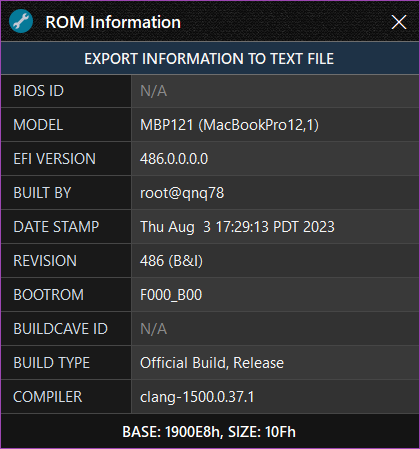

<h1 align="center">

 
Mac EFI Toolkit V1.2.0
</h1>

<h4 align="center">A tool for analysis of Mac BIOS/UEFI and Intel T2 SOCROM, with limited editing capabilities.</h4>

  <a href="#about">About</a> •
  <a href="#features">Features</a> •
  <a href="#download">Download</a> •
  <a href="#requirements">Requirements</a> •
  <a href="#acknowledgements">Acknowledgements</a> •
  <a href="#donate">Donate</a>

## About

Mac EFI Toolkit, or 'mefit', is a valuable tool built to aid technicians in analysing and repairing Mac EFI and Intel T2 SOCROM firmwares. Designed to be compact, this application provides information gathering capabilities and limited editing functionality.

>🛈 **Access to some features requires accepting the editing terms.**

| Startup Window                                   | About Window |
| ------------------------------------------------ |--------------|
|  |  |

| EFI Window                                       | ROM Information Window |
| ------------------------------------------------ |-----------------------
|      |  |

## Features

- Application
  - All files are edited in memory, preserving the original.
  - Knuth–Morris–Pratt algorithm for binary data searching.
  - Backup firmwares to a .zip archive for long term storage.
  - Automatic handling of uncaught exceptions.
  - DPI scaling support.
  - Drag and drop support.
  - New version notifications.
  - No installation required.
  - Works with Wine.
- Firmware (EFIROM)
  - View the firmware checksum, created and modified date.
  - View the model, config code, system serial, hardware configuration code and system order number.
  - Check the system serial on EveryMac.
  - View the EFI version and ROM section information.
  - View the Intel Management Engine version and base address.
  - View the Platform Data Region Board-ID (UEFI 2013+).
  - View if the firmware is APFS capable
  - Export and replace the Intel Management Engine firmware region.
  - Export and replace the Fsys store section.
  - Detect and repair invalid Fsys CRC32 checksums.
  - View and validate binary size.
  - Reset NVRAM stores with proper header configuration.
  - Detect and remove EFI passwords (EFI lock).
- T2 SOCROM
  - TODO

## Download

| Version| Release Date| Latest | Channel |
|--------|-------------|--------|---------|
|[1.2.0](https://github.com/MuertoGB/MacEfiToolkit/releases/latest)| Not Set, 2024 | Yes | Stable |

> 📋 View the full changelog [here](CHANGELOG.md)

## Manual

TODO - The original manual is outdated, and being rewritten.

## Requirements

**Application:**
- Microsoft [.NET Framework 4.8](https://dotnet.microsoft.com/en-us/download/dotnet-framework/net48)
- Windows 7, 8, 8.1, 10 and 11. 32, or 64-bit
- Internet connectivity required for:-
  - Version checking, which can be disabled in the settings.
  - Retrieving configuration codes from the server they're not present in the database.

**Build requirements:**
- [Visual Studio 2022](https://visualstudio.microsoft.com/vs/), targeting .NET Framework 4.8.

## Acknowledgements

**This software uses the following third party libraries, or resources:-**

LZMA [v22.01 SDK](https://www.7-zip.org/sdk.html), by Igor Pavlov.\
The [Knuth-Morris-Pratt algorithm](https://en.wikipedia.org/wiki/Knuth%E2%80%93Morris%E2%80%93Pratt_algorithm), by Donald Knuth, James H. Morris, and  Vaughan Pratt.\
[MacModelShelf](https://github.com/MagerValp/MacModelShelf) database, by MagerValp.\
Application icon by [Creatype](https://www.flaticon.com/free-icon/toolkit_6457096?term=toolkit&page=1&position=38&origin=search&related_id=6457096), menu icons by [afif-fudin](https://www.flaticon.com/authors/afif-fudin).

## Donate

All donations go back into improving my software and workspace:

